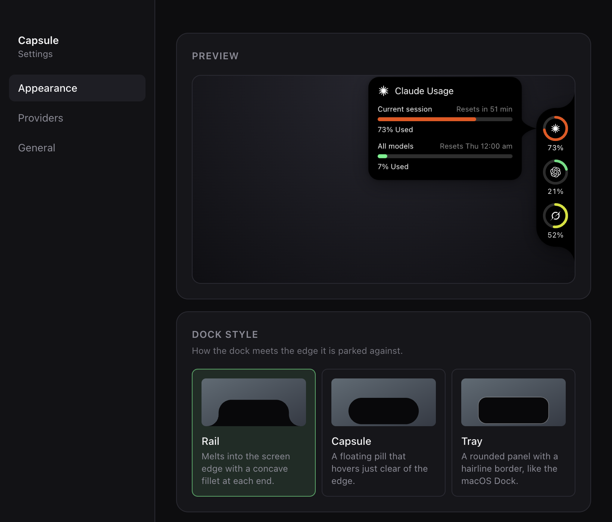
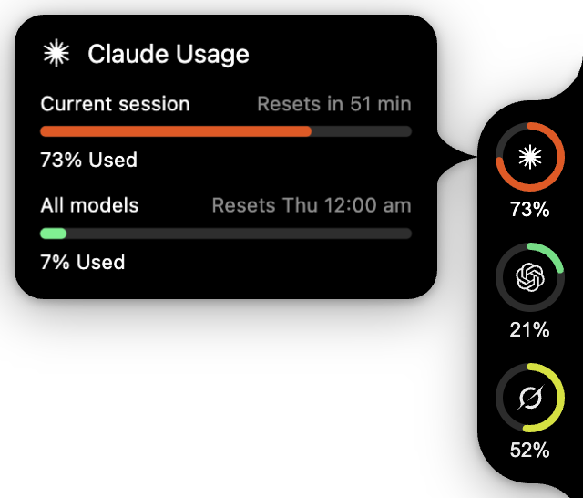
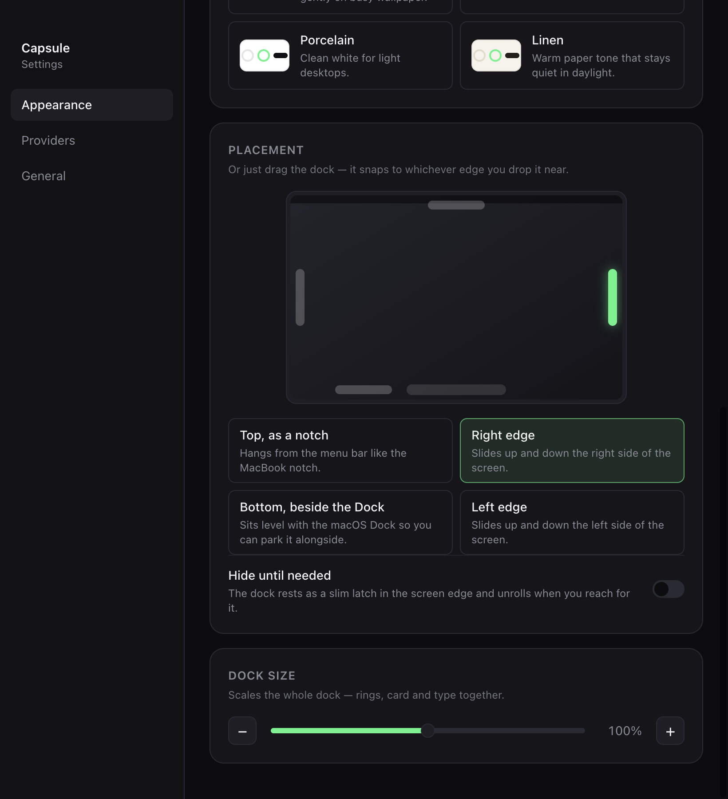

<div align="center">

# Capsule

### A quiet edge dock for your AI coding tools

Capsule keeps usage limits, local agent activity, and reset times at the edge
of your Mac—visible when you need them and folded away when you do not.



<sub>Captured from Capsule on macOS with its built-in demo data.</sub>

</div>

## At a glance

- See usage for Claude, Codex, Grok, Cursor, and GitHub Copilot.
- Know when local Claude Code, Codex, or Grok sessions are working, waiting,
  or finished.
- Get small, non-blocking activity notices without leaving your current app.
- Check Claude and Codex token totals for today and the last 30 days.
- Park the dock on any screen edge, resize it, or let it fold into a slim latch.
- Choose light or dark themes and Rail, Capsule, or Tray dock styles.

<p align="center">
  
</p>

## Make it yours

Choose a theme, move Capsule to any screen edge, control when it folds away,
and scale the whole dock from one place.

<p align="center">
  
</p>

## Provider support

| Provider | Usage | Activity notices | Local token totals |
| --- | :---: | :---: | :---: |
| Claude | Yes | Yes | Yes |
| Codex | Yes | Yes | Yes |
| Grok | Yes | Yes | — |
| Cursor | Yes | — | — |
| GitHub Copilot | Yes | — | — |

Claude, Codex, and Grok are enabled by default. Cursor and GitHub Copilot can
be enabled from **Settings → Providers**.

## How it works

Capsule reuses sessions already stored by the tools on your Mac. It does not
ask you to create another account or sign in again. Usage readers contact each
provider's usage service; activity and token counts come from bounded reads of
local session records.

The dock keeps the last good reading when a refresh fails and marks it as
stale instead of inventing a number. Provider endpoints and local file formats
can change, so an installed tool may occasionally show as unavailable until
Capsule is updated.

Activity notices are passive. Capsule does not install hooks, send prompts,
approve actions, or control an agent. The experimental agent chat source is
kept in the repository but is not started, built, or exposed in the app.

## Install

Download the latest `.dmg` from
[Releases](https://github.com/antick/capsule/releases), open it, and drag
Capsule to Applications. Pick the `arm64` build for Apple silicon and the
`x64` build for Intel Macs.

Capsule lives in the menu bar, not the Dock. On first launch it parks itself on
the right edge of your screen; right-click it or use the menu bar icon for
**Settings**.

Releases are not yet signed with an Apple Developer ID. macOS will refuse to
open an unsigned download the first time:

1. Open **System Settings → Privacy & Security**
2. Scroll to the message about Capsule being blocked, and click **Open Anyway**
3. Confirm in the dialog that follows

Until a release is signed, Capsule cannot replace itself in place — **Settings →
Updates** says so and links to the release page instead of downloading.

## Updates

**Settings → Updates** shows the running version, checks GitHub Releases for a
newer one, and installs it with a restart. Capsule checks on launch and once a
day; turn that off, or turn on background downloading, on the same page. The
check sends nothing but the request for the release feed.

## Run it locally

Capsule requires macOS, Node.js 22 or newer, and pnpm 11.25.0.

```bash
pnpm install --frozen-lockfile
pnpm dev
```

Right-click the dock for **Settings**, **Keep open**, placement shortcuts, and
**Quit Capsule**. You can also use the menu bar icon. Turn on **Demo mode** in
Settings to explore the full interface without provider accounts.

## Check a change

```bash
pnpm check
pnpm typecheck
pnpm test
pnpm build
```

Build an installable app without publishing it — the DMGs and zips land in
`apps/desktop/release`:

```bash
pnpm dist
```

## Cut a release

1. Bump `version` in `apps/desktop/package.json`
2. Add the release to `CHANGELOG.md`
3. Commit both
4. Run `pnpm release:tag`, then push the tag it prints

Pushing the tag runs the Release workflow: it re-runs the checks, builds the
arm64 and x64 apps, and publishes them to GitHub Releases. To sign and notarise
those builds, add `MAC_CERTIFICATE`, `MAC_CERTIFICATE_PASSWORD`,
`APPLE_API_KEY`, `APPLE_API_KEY_ID`, and `APPLE_API_ISSUER` as repository
secrets; without them the build still publishes, unsigned.

The native notification check runs after a build and uses temporary files and
sample data. It does not contact provider accounts.

```bash
CAPSULE_PLAYWRIGHT_PATH=/path/to/playwright \
  node apps/desktop/scripts/verify-notifications.cjs
```

## Project layout

```text
apps/desktop       Electron app and renderer windows
packages/activity Local agent activity and token readers
packages/config   Shared settings, copy, and visual constants
packages/dates    Shared reset-time formatting
packages/hud      Edge dock, meters, cards, and notices
packages/usage    Provider usage readers and polling
openspec          Product specs and design history
```

Capsule uses Electron, React, TanStack Router, Tailwind CSS, Biome, pnpm
workspaces, and Turborepo.
